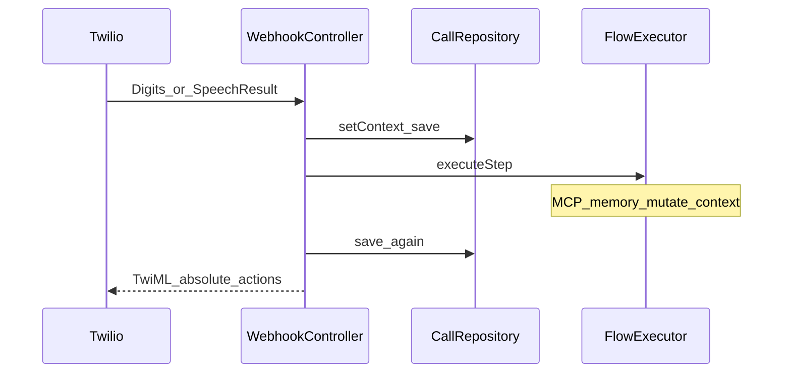

# IVR + Speech Remediation Design

> **Date:** 2026-08-03  
> **Status:** Approved for implementation (3 PRs)  
> **Branch context:** `cursor/session-expired-ux`  
> **SDK:** `twilio/sdk` 8.11.6 only (no laravel-twilio wrapper)

## Goal

Make Twilio IVR and ConversationRelay speech locale-correct and state-correct: Call context survives across steps, Test Call respects consent, TwiML actions are absolute when required, spoken prompts follow `flow.language`, ConversationRelay uses official Twilio voice defaults when unset, and React Doctor Critical errors from this work are cleared.

## Decisions (brainstorming)

| Decision | Choice |
| --- | --- |
| Scope | C — runtime + speech i18n + ElevenLabs defaults + React Doctor P0 |
| Call context persistence | Hybrid: controller saves Digits/Speech before `executeStep` and saves again after |
| Test Call consent | Enforce (resolve tenant by To / From / flow_id) |
| Spoken i18n | `lang/*` speech keys; tenant `consent_message` wins if set |
| Delivery | Three sequential PRs |
| ConversationRelay empty voice | Omit `setVoice` → Twilio CR language defaults |
| New Twilio products (TAC/Studio/Dialogflow) | Out of this cycle |

## Architecture

Dual path remains:

1. **Classic IVR** — TwiML `<Say>` / `<Gather>` / `<Redirect>` via `FlowExecutor` + `WebhookController`
2. **AI turns** — `<Connect><ConversationRelay>` over `wss://` to `ServeTwilioConversationRelay`

## Library constraints (verified)

- Composer Twilio package: **only** `twilio/sdk` 8.11.6
- Related: `laravel/mcp` 0.8.2 — `Client::web($url)->withToken($token)` for MCP HTTP tools
- Use existing SDK APIs only: `VoiceResponse::{say,gather,connect,redirect,hangup}`, `RequestValidator::validate`, `Client::calls->create`, `ConversationRelay::{setVoice,setIntelligenceService,parameter,...}`
- Docs: Say language+voice must match; Gather Digits/SpeechResult on action; error 15004 requires absolute action URLs when Call uses inline `twiml`; CR voice defaults per language table

## PR1 — Runtime Twilio correctness

1. Hybrid Call context save in `WebhookController::step` (and after every `executeStep`)
2. Absolute `TwilioPublicUrl::to(...)` for all Gather/Redirect/consent actions
3. Tenant resolve: To OR From OR flow_id→flow→tenant; consent on Test Call; preserve `flow_id` on consent Gather action
4. Migration: backfill `flows.language` `en`→`en-US`; default `en-US`; normalize via `FlowSpeechLocale::bcp47` in repo/resource
5. MCP: apply `withToken` when configured; generic errors to call context
6. `FlowSimulator` stubs: `mcp_tool`, `voice_agent`, `analyze`, `memory`

## PR2 — Spoken locale + ConversationRelay voices

1. `lang/{locale}/speech.php` (or `speech.*`) for consent defaults, goodbye, not_configured, MCP/webhook/relay failures
2. Map flow BCP-47 → app locale (`es-ES`→`es`)
3. Localize CR `welcomeGreeting` default + AI error fallback
4. Empty voice → omit `setVoice`; optional `config/flow.php` map copied from Twilio CR defaults (`es-ES`→`6xftrpatV0jGmFHxDjUv`; `es-MX`→ Twilio `es-US` voice `CaJslL1xziwefCeTNzHv`)

## PR3 — React Doctor P0

1. Fix `frequencyLabels` fresh deps in Scheduled Calls (and PhoneNumbers if TP)
2. Purify CommandPalette `setOpen` updater
3. `type="button"` + `aria-label` on flagged controls
4. Re-scan `npx react-doctor@latest --verbose --scope changed --base main`

## Twilio product stance

Keep IVR + ConversationRelay. Do not adopt TAC/Studio/Dialogflow/Flex in this cycle. `intelligenceService` field already exists (partial); full CI wiring is a follow-up PR if approved.

## Out of scope

- Mass rewrite of voice_agent voices on language Save
- Relay WS auth/concurrency ADR
- Inventing ElevenLabs voice IDs
- Installing react-doctor as a project dependency

## Success criteria

- Feature tests: Digits visible in next Say; MCP result persists; consent Gather absolute URL + flow_id; language backfill; Spanish speech strings; CR omits empty voice
- Unit: MCP `withToken` path; FlowSpeechLocale voices
- React Doctor Critical errors from listed P0 set cleared
